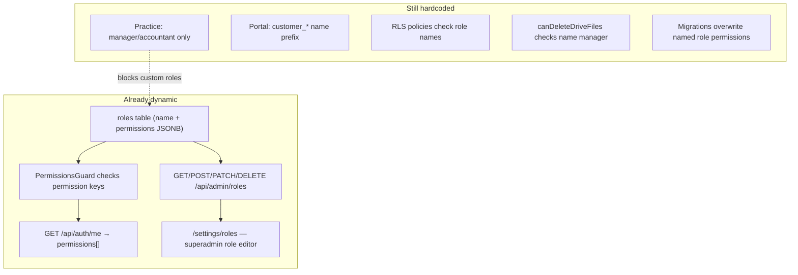
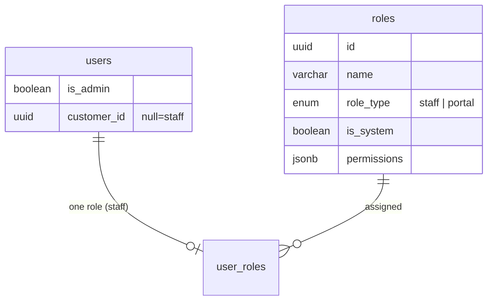
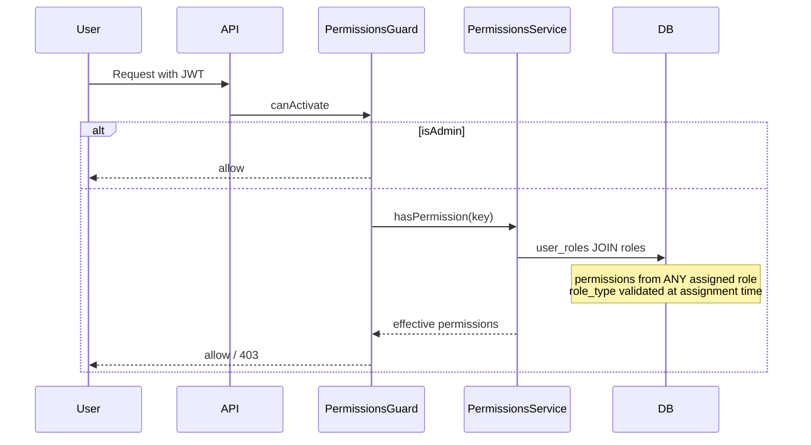

# Dynamic Permissions & Roles Architecture Plan

## Current state assessment

The system is **partially dynamic** — not fully static:



| Layer | Status | Key files |
|-------|--------|-----------|
| Role storage | Dynamic (DB rows) | [`backend/src/entities/role.entity.ts`](backend/src/entities/role.entity.ts) |
| Permission keys | Semi-dynamic (editable JSONB, catalog in code) | [`backend/src/admin/permission-catalog.ts`](backend/src/admin/permission-catalog.ts) |
| Route enforcement | Mostly key-based | [`backend/src/auth/permissions.guard.ts`](backend/src/auth/permissions.guard.ts) |
| Role CRUD API | Exists (superadmin-only) | [`backend/src/admin/admin-roles.controller.ts`](backend/src/admin/admin-roles.controller.ts) |
| Role assignment | **Blocked for custom roles** | [`backend/src/admin/admin-users.service.ts`](backend/src/admin/admin-users.service.ts) |
| Portal assignment | **Name prefix only** | [`backend/src/customers/customer-portal-user.service.ts`](backend/src/customers/customer-portal-user.service.ts) |
| DB RLS | **Role name checks** | [`backend/src/migrations/1749330000000-CustomersRlsPracticeStaffInsertRoleFallback.ts`](backend/src/migrations/1749330000000-CustomersRlsPracticeStaffInsertRoleFallback.ts) |
| Frontend gates | Mixed (permissions + role names) | [`frontend/src/utils/canDeleteDriveFiles.ts`](frontend/src/utils/canDeleteDriveFiles.ts) |

**Critical gap:** A superadmin can create a role like `senior_manager` with `file:delete` via Settings → Roles, but **cannot assign it** to practice staff (only `manager`/`accountant` allowed), and even if assigned manually in DB, **RLS and UI would still fail** because they check role **names**, not permission keys.

Historical migration [`1747100000000-EnforceFourRolesAndPermissions.ts`](backend/src/migrations/1747100000000-EnforceFourRolesAndPermissions.ts) deleted all non-canonical roles — signaling the tension between "dynamic CRUD" and "four fixed roles."

---

## Target architecture (aligned with your choices)

**Confirmed scope:**
- **Single role per practice user** (keep current constraint)
- **Superadmin-only** role/permission management (keep `AdminGuard`; no `admin_role:*` delegation in this phase)

**Core design change:** Replace role-**name** coupling with role-**type** metadata + permission-key enforcement.



### Assignment rules (target)

| User type | Assignable roles | Enforcement |
|-----------|------------------|-------------|
| Practice staff (`customer_id` null) | Any role where `role_type = 'staff'` | `staff_customer_assignments` + permission keys |
| Portal user (`customer_id` set) | Any role where `role_type = 'portal'` | JWT customer scope + permission keys |
| Superadmin | No role row required | `is_admin` bypass (unchanged) |

### System roles (seeded, editable permissions, protected identity)

Mark existing four roles `is_system = true`:
- `manager`, `accountant` → `role_type = 'staff'`
- `customer_admin`, `customer_user` → `role_type = 'portal'`

Custom roles: `is_system = false`, full create/rename/delete (when unassigned).

### What stays unchanged

- **No `PermissionEntity` table** in Phase 1 — keep JSONB arrays on roles; catalog remains in [`permission-catalog.ts`](backend/src/admin/permission-catalog.ts)
- **No permissions in JWT** — continue resolving via `/auth/me` + `PermissionsService` cache
- **No role hierarchy** — flat union model (single role per staff user simplifies this further)
- **Global roles** — not per-customer role definitions (tenant isolation stays via RLS + assignments)

---

## Implementation phases

### Phase 1 — Schema + assignment unlock (highest priority)

**New migration** (register in [`typeorm-migrations.registry.ts`](backend/src/typeorm-migrations.registry.ts)):

```sql
ALTER TABLE roles ADD COLUMN role_type varchar(16) NOT NULL DEFAULT 'staff';
ALTER TABLE roles ADD COLUMN is_system boolean NOT NULL DEFAULT false;
ALTER TABLE roles ADD COLUMN description varchar(512);

UPDATE roles SET role_type = 'portal', is_system = true
  WHERE name IN ('customer_admin', 'customer_user');
UPDATE roles SET role_type = 'staff', is_system = true
  WHERE name IN ('manager', 'accountant');
```

**Backend changes:**

1. Extend [`RoleEntity`](backend/src/entities/role.entity.ts) with `roleType`, `isSystem`, `description`
2. [`AdminRolesService`](backend/src/admin/admin-roles.service.ts):
   - Require `roleType` on create; validate permissions against existing regex
   - Block rename/delete of `is_system` roles (permissions still editable)
   - Add optional `?role_type=staff|portal` filter on list endpoint
3. [`AdminUsersService`](backend/src/admin/admin-users.service.ts) — replace:

```typescript
const PRACTICE_STAFF_ROLE_NAMES = new Set(["manager", "accountant"]);
// → assert all roleIds resolve to roles where roleType === 'staff'
```

4. [`CustomerPortalUserService`](backend/src/customers/customer-portal-user.service.ts) — replace `name.startsWith("customer_")` with `role.roleType === 'portal'`
5. Add **PATCH portal user role** endpoint (currently missing — role is set only at create time; must keep `user_roles` + `customer_users.role_id` in sync)

**Frontend changes:**

1. [`StaffSettingsUsersPage.tsx`](frontend/src/pages/StaffSettingsUsersPage.tsx) — role dropdown from `GET /admin/roles?role_type=staff` (not hardcoded manager/accountant)
2. [`CustomerUsersPage.tsx`](frontend/src/pages/CustomerUsersPage.tsx) — use filtered portal roles
3. [`RolesSettingsPage.tsx`](frontend/src/pages/RolesSettingsPage.tsx) — add `roleType` selector on create; show system-role badge; disable rename for system roles
4. Add **Roles link** to [`StaffSettingsLayout.tsx`](frontend/src/layout/StaffSettingsLayout.tsx) nav (page exists at `/settings/roles` but is not linked)
5. Extend [`AdminRoleRow`](frontend/src/types/api.ts) type + API client

**Outcome:** Superadmin can create `senior_accountant` (`role_type=staff`, custom permissions) and assign it to practice users.

---

### Phase 2 — Replace role-name enforcement with permission keys

These are the places that silently break custom roles today:

| Location | Current check | Target check |
|----------|---------------|--------------|
| [`canDeleteDriveFiles.ts`](frontend/src/utils/canDeleteDriveFiles.ts) | role name `manager` | `hasPermission('file:delete')` |
| [`file-delete.policy.ts`](backend/src/files/file-delete.policy.ts) | role name `manager` | `file:delete` permission |
| [`customers.service.ts`](backend/src/customers/customers.service.ts) | seed assignments for `manager`/`accountant` names | seed for all `role_type=staff` users OR users with `customer:write` |
| [`admin-notification-broadcast.service.ts`](backend/src/notification/admin-notification-broadcast.service.ts) | lookup by name `manager`/`accountant` | filter by `role_type=staff` + optional permission |
| [`notification-audience.resolver.ts`](backend/src/notification/) | hardcoded `customer_admin`/`customer_user` | `role_type=portal` or permission filter |
| Frontend accountant/manager name checks | `DocumentsPage`, dashboard cards | permission-based where possible |

**RLS migration** — replace in [`1749330000000-CustomersRlsPracticeStaffInsertRoleFallback.ts`](backend/src/migrations/1749330000000-CustomersRlsPracticeStaffInsertRoleFallback.ts) pattern:

```sql
-- New SQL helper function (new migration)
CREATE OR REPLACE FUNCTION app.user_has_permission(p_key text) ...
-- Checks user_roles → roles.permissions JSONB for current app.user_id
```

Then update customer INSERT policy to use `app.user_has_permission('customer:write')` instead of `lower(r.name) IN ('manager', 'accountant')`.

---

### Phase 3 — Migration hygiene + guard coverage

1. **Stop destructive role migrations** — future permission additions should use idempotent `UPDATE roles SET permissions = ... WHERE name = 'manager'` only for `is_system` roles, or add new keys via a helper that **merges** rather than overwrites admin-edited sets
2. **Add DB unique constraint** on `roles.name` (currently app-only uniqueness)
3. **Audit routes** missing `@UseGuards(PermissionsGuard)` — document in [`permissions-reference.md`](docs/permissions-reference.md)
4. **Smoke script** — extend or replace [`scripts/test-rbac.js`](backend/scripts/test-rbac.js) to cover: create custom role → assign → verify API access + RLS

---

## Authorization flow (after changes)



---

## Risks and mitigations

| Risk | Mitigation |
|------|------------|
| Custom role missing permissions → user locked out | Role editor shows catalog matrix; system roles remain as templates |
| RLS still checks names after Phase 1 | Phase 2 is required before production custom roles |
| Admin-edited permissions overwritten by deploy migration | Merge-only migration pattern; never re-run `EnforceFourRoles` style deletes |
| Frontend UI gates don't match API | Phase 2 replaces name checks; new permissions still need frontend wiring (document in permissions-reference) |
| Portal role change desyncs `user_roles` / `customer_users` | New PATCH endpoint updates both in one transaction |

---

## Files to change (summary)

**Backend (primary):**
- [`backend/src/entities/role.entity.ts`](backend/src/entities/role.entity.ts)
- [`backend/src/admin/admin-roles.service.ts`](backend/src/admin/admin-roles.service.ts) + controller
- [`backend/src/admin/admin-users.service.ts`](backend/src/admin/admin-users.service.ts)
- [`backend/src/customers/customer-portal-user.service.ts`](backend/src/customers/customer-portal-user.service.ts)
- [`backend/src/files/file-delete.policy.ts`](backend/src/files/file-delete.policy.ts)
- [`backend/src/customers/customers.service.ts`](backend/src/customers/customers.service.ts)
- New migration(s) + registry entry
- New RLS helper migration

**Frontend (primary):**
- [`frontend/src/pages/RolesSettingsPage.tsx`](frontend/src/pages/RolesSettingsPage.tsx)
- [`frontend/src/pages/StaffSettingsUsersPage.tsx`](frontend/src/pages/StaffSettingsUsersPage.tsx)
- [`frontend/src/pages/CustomerUsersPage.tsx`](frontend/src/pages/CustomerUsersPage.tsx)
- [`frontend/src/utils/canDeleteDriveFiles.ts`](frontend/src/utils/canDeleteDriveFiles.ts)
- [`frontend/src/layout/StaffSettingsLayout.tsx`](frontend/src/layout/StaffSettingsLayout.tsx)
- [`frontend/src/types/api.ts`](frontend/src/types/api.ts) + [`frontend/src/api/client.ts`](frontend/src/api/client.ts)

**Docs:**
- Update [`docs/roles-and-permissions-guide.md`](docs/roles-and-permissions-guide.md) — custom roles section
- Update [`docs/permissions-reference.md`](docs/permissions-reference.md) — note `role_type` assignment rules

---

## Success criteria

1. Superadmin creates a custom staff role (e.g. `document_specialist`) with a subset of permissions
2. Assigns it to a practice user via Settings → Users
3. User can access only routes their permissions allow (API + UI + RLS consistent)
4. System roles (`manager`, `accountant`, `customer_admin`, `customer_user`) remain as editable templates, protected from rename/delete
5. Portal user role can be changed after creation
