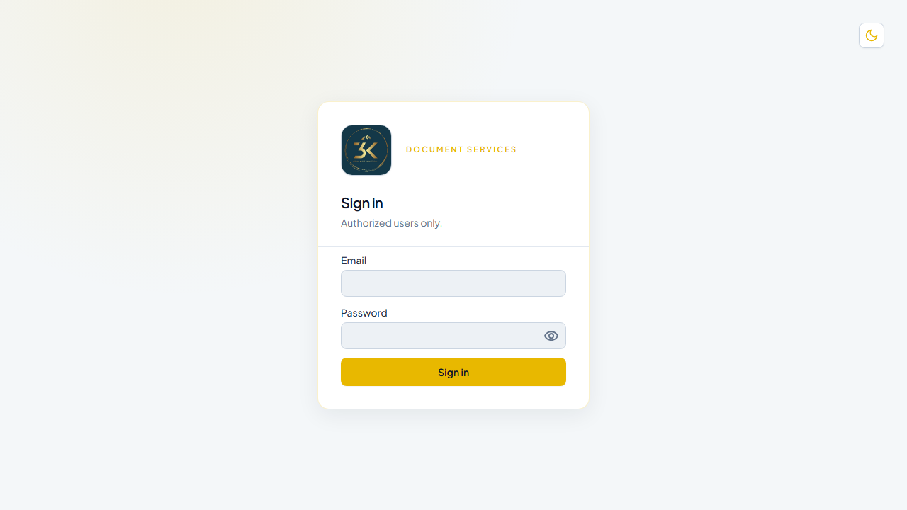
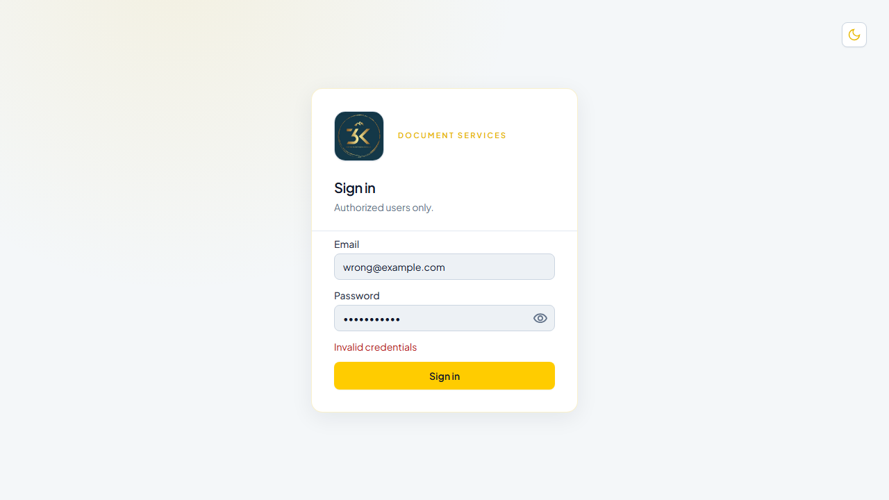
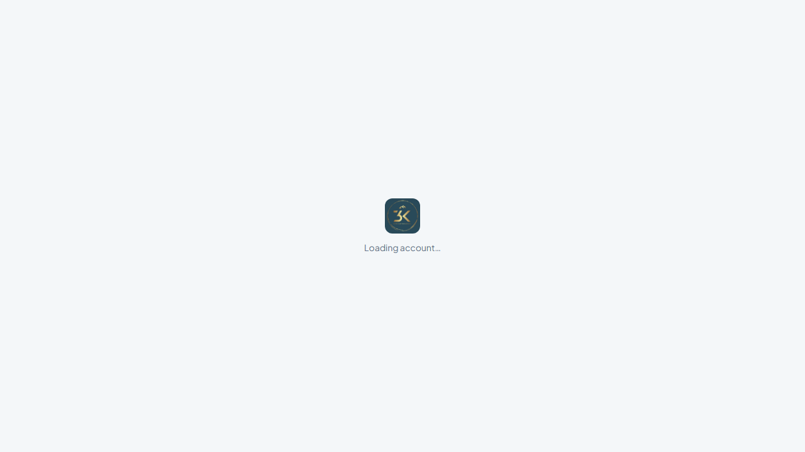

# Authentication

**Environment:** https://dhanbiz.example.com  
**Generated:** 23/06/2026, 11:01:29

---

## Overview

All protected routes require a valid session. Users sign in with their email and password on the `/login` page. On success the app redirects to the user's home screen based on their role. Sessions are maintained via a short-lived JWT access token (15 min) and a long-lived refresh token (7 days) stored in `localStorage`.

---

## Step 1 — Login Page

Navigate to the application URL. Unauthenticated users are automatically redirected to `/login`.

- **Email field** — accepts username or email address
- **Password field** — masked by default with a visibility toggle
- **Sign in button** — submits credentials to `POST /api/auth/login`

## Step 2 — Invalid Credentials Error

If the email or password is incorrect the API returns `401 Unauthorized` and a red error message appears below the password field.

## Step 3 — Password Visibility Toggle

Click the eye icon on the right of the password field to reveal the typed characters. Click again to re-mask.

## Step 4 — Successful Sign In

On valid credentials the app issues a JWT pair and navigates the user to their default landing page:

| Role | Landing page |
|---|---|
| Superadmin | `/dashboard` |
| Staff (role-based) | First permitted module |
| Customer portal user | `/customers/:id/dashboard` |

---

## Test Results

| Test | Status |
|---|---|
| Login page renders correctly | ✅ Pass |
| Invalid credentials show error | ✅ Pass |
| Password visibility toggle works | ✅ Pass |
| Valid credentials redirect to home | ✅ Pass |
| Unauthenticated redirect to /login | ✅ Pass |
