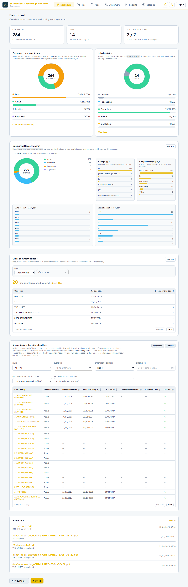

# Dashboard

**Environment:** https://dhanbiz.example.com  
**Generated:** 23/06/2026, 11:01:30

---

## Overview

The Admin Dashboard (`/dashboard`) gives a real-time snapshot of the firm's operational state. It is visible to Superadmins and staff with the `dashboard:read` permission.

---

## KPI Summary Tiles

Three headline tiles at the top of the page show:
- **Customers** — total registered clients
- **Jobs** — total extraction jobs across all customers
- **Subscription Plans** — active vs total plans configured

## Customer & Job Status Charts

Donut charts break down:
- **Customers by account status** — Draft, Active, Inactive, Proposed
- **Jobs by pipeline status** — Queued, Processing, Completed, Failed, Cancelled

Hover over any segment to see the exact count and percentage.

## Accounts & Confirmation Deadlines

A filterable table lists every customer's Companies House filing deadlines — year-end accounts and confirmation statements. Staff can:
- Filter by customer name or deadline date range
- Highlight overdue filings (shown in red)
- Export the full list as CSV
- Click a customer name to open their workspace

---

## Test Results

| Test | Status |
|---|---|
| Dashboard loads for admin | ✅ Pass |
| KPI tiles visible | ✅ Pass |
| Charts render | ✅ Pass |
