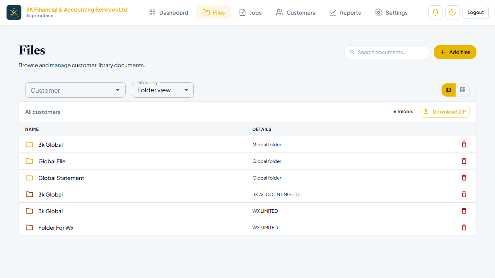

# Files

**Environment:** https://fs3kltd.infurotech.com  
**Generated:** 23/06/2026, 11:01:33

---

## Overview

The Files module (`/files`) is the global document library listing every file uploaded across all customer accounts.

Permissions: `file:read` to view · `file:write` to upload or delete

---

## Document Library

A searchable, filterable table of all documents.

**Columns:** Filename · Customer · Folder · Type · Pages · Status · Uploaded By · Date  
**Row actions:** Download · View extraction results · Delete

---

## Test Results

| Test | Status |
|---|---|
| Files library loads | ✅ Pass |
