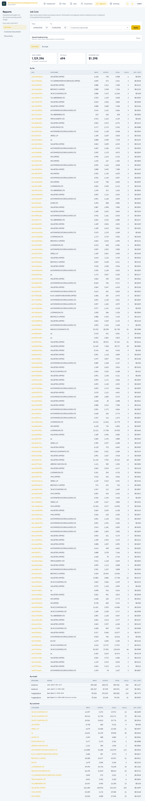
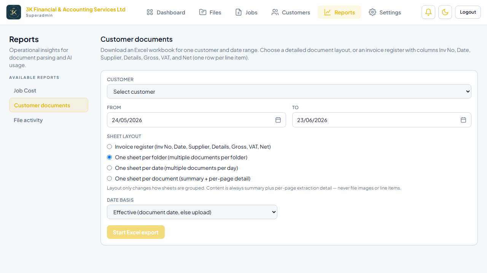
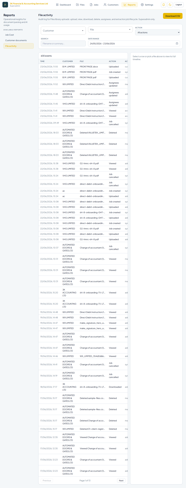

# Reports

**Environment:** https://fs3kltd.infurotech.com  
**Generated:** 23/06/2026, 11:01:33

---

## Overview

The Reports section (`/reports`) gives admins visibility into AI usage costs, document processing volumes, and file audit trails. Admin-only (`is_admin` flag required).

---

## 1. Job Cost Report

Route: `/reports/job-cost`

Breaks down AI extraction costs per job. Each row shows the customer, document filename, AI model used, input and output token counts, and cost in USD. Filterable by customer and date range; exportable to CSV.

**Use cases:** Monthly billing reconciliation · Cost-per-client analysis · Comparing model costs

## 2. Customer Documents Report

Route: `/reports/customer-documents`

Aggregates document processing statistics per customer: total files uploaded, total pages processed, completed vs failed job counts, and date of last activity.

**Use cases:** Capacity planning · Identifying high-volume customers

## 3. File Activity Report

Route: `/reports/file-activity`

Full audit trail of file events — uploads, downloads, extraction triggers, and deletions. Each event records the acting staff member, timestamp, customer, and file reference.

**Use cases:** Compliance auditing · Debugging missing documents · Reviewing staff activity

---

## Test Results

| Test | Status |
|---|---|
| /reports redirects to /reports/job-cost | ✅ Pass |
| Job Cost report loads | ✅ Pass |
| Customer Documents report loads | ✅ Pass |
| File Activity report loads | ✅ Pass |
