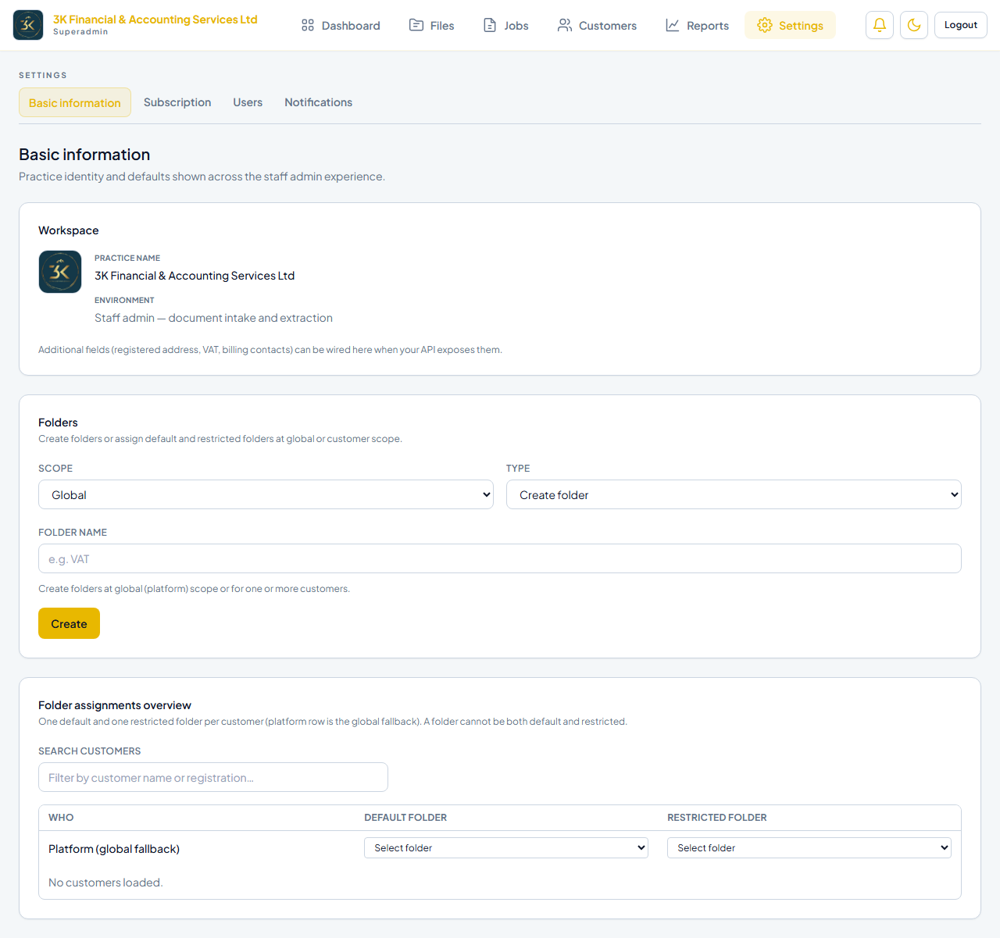
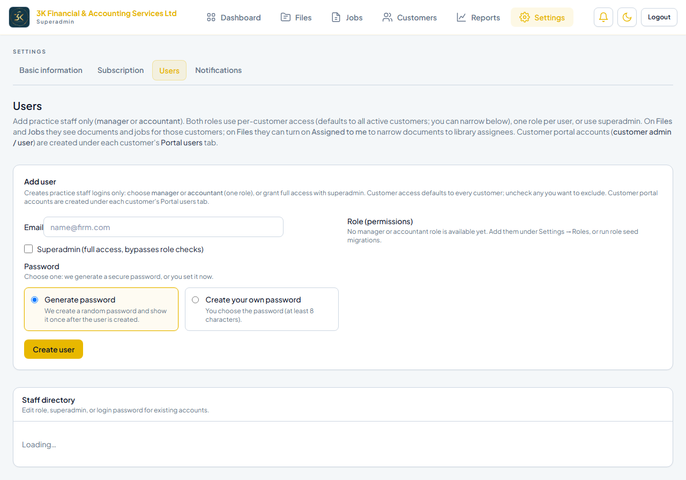
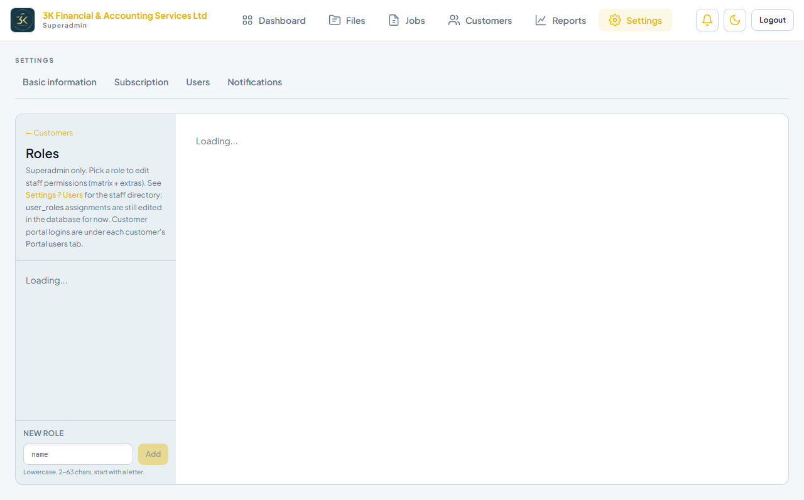
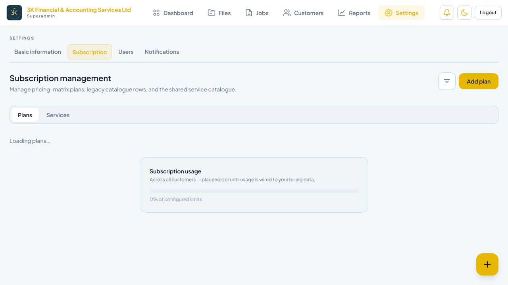
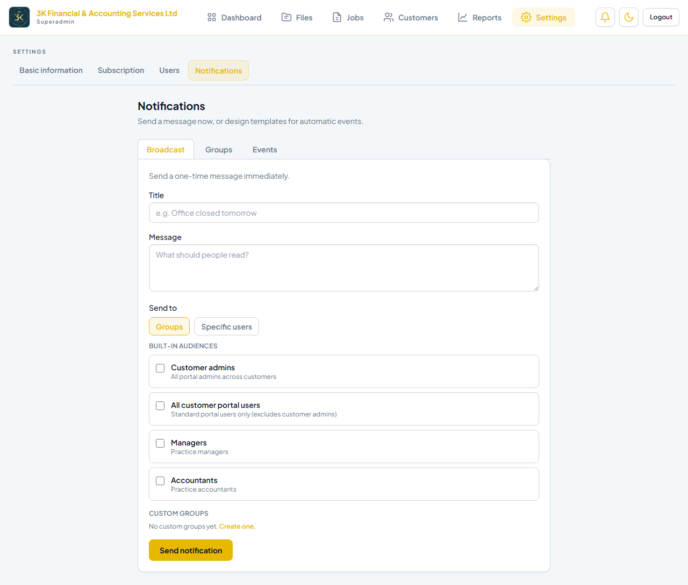

# Settings

**Environment:** https://dhanbiz.example.com  
**Generated:** 23/06/2026, 11:01:29

---

## Overview

The Settings section (`/settings`) is accessible to Superadmins and staff with `settings:read` or `settings:write`. It has five tabs covering firm config, user accounts, RBAC, subscription plans, and notifications.

---

## 1. Organisation Information

Route: `/settings/information`

Configures the firm's public-facing details used in generated PDFs and email templates:
- Trading name and logo upload
- Registered address
- Primary contact email and phone
- Brand colour

## 2. User Management

Route: `/settings/users`

Create and manage staff accounts. Each user has a name, email, and one or more assigned roles. Superadmin accounts bypass all permission checks.

## 3. Roles & Permissions

Route: `/settings/roles`

Create custom roles with fine-grained permission toggles across two namespaces:

**Staff permissions:** `customer:read/write` · `job:read/create/update` · `file:read/write/delete` · `dashboard:read` · `settings:read/write` · `subscription_plan:read/write`

**Portal permissions:** `portal:file:read/write` · `portal:job:read/create` · `portal:customer:read/write` · `portal:settings:read/write` · `portal:user:read/write`

## 4. Subscription Plans

Route: `/settings/subscription`

Defines the service bundles offered to customers:
- Plan name and description
- Included services (VAT returns, payroll, accounts, etc.)
- Add-on services and unit pricing
- Billing frequency (monthly / annual)
- Usage limits (file uploads, extraction jobs per month)

## 5. Notifications

Route: `/settings/notifications`

- **Event notifications** — triggered by job completion, file upload, customer status changes
- **Broadcast messages** — one-off announcements to all portal users
- SMTP delivery configuration

---

## Test Results

| Test | Status |
|---|---|
| Settings page loads | ✅ Pass |
| Navigation tabs visible | ✅ Pass |
| Users tab accessible | ✅ Pass |
| Roles tab accessible | ✅ Pass |
| Subscription tab accessible | ✅ Pass |
| Notifications tab accessible | ✅ Pass |
