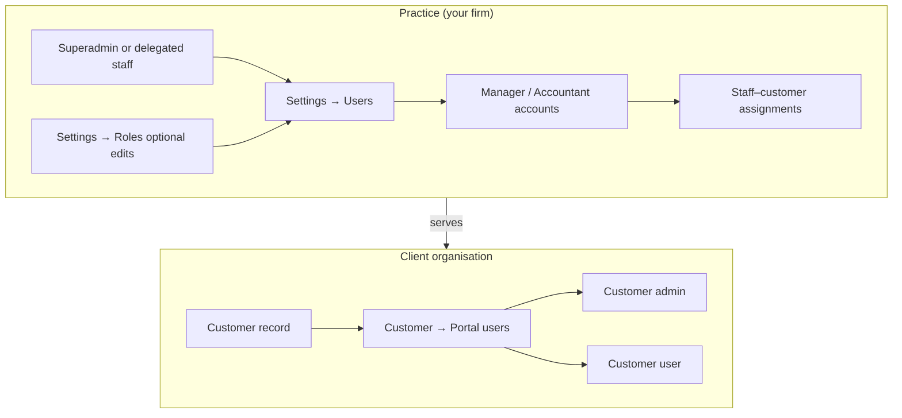

# Roles and permissions guide

This document is for **end users and administrators** who need to understand who can do what in the application, how access is decided, and where each type of account is managed.

It reflects the product’s **intended model**: five distinct concepts—**Superadmin**, **Manager**, **Accountant**, **Customer admin**, and **Customer user**—plus the underlying **permission keys** that gates enforce.

---

## 1. Two kinds of people using the app

| Group | Who they are | Typical login | Linked to |
|--------|----------------|-----------------|-----------|
| **Practice staff** | People who work for your firm (3K / practice) | Staff email | No single customer; they work across **assigned customers** (unless Superadmin). |
| **Customer portal users** | People who work for a **client organisation** | Portal email | Exactly **one customer** (their company’s record). |

Permissions are split so that staff use **non-portal** keys (for example `customer:read`, `job:read`) and portal users use **`portal:*`** keys (for example `portal:file:read`). The system maps some of these together when a portal user opens customer-scoped screens (see §6).

---

## 2. The five roles (plain language)

### 2.1 Superadmin

- **What it is:** A **flag on the practice user account** (full internal administrator), **not** a row in the “roles” table used for Manager / Accountant / portal roles.
- **Power:** **Bypasses normal permission checks** and is not limited by customer assignment the same way as other staff.
- **Typical use:** Owners, IT, or senior leads who must manage **all customers**, **staff users**, **role definitions**, and sensitive settings APIs.
- **In the UI:** Often labelled “Superadmin”; the session exposes full access.

**Rule of thumb:** If someone is Superadmin, treat them as having **every** permission until you turn the flag off.

---

### 2.2 Manager (practice staff)

- **What they do:** Run the **customer workspace** end to end for clients they are assigned to: customers list, files, jobs, assignments, and related write actions where the product enforces them.
- **Typical use:** Client leads, seniors, or anyone who **owns the relationship** with a customer and coordinates work.
- **Scope:** Only customers (and data paths) where the practice has **linked** that manager in **staff–customer assignments**—unless the account is Superadmin.

**Default permission bundle (baseline seeded in the database):**

| Area | Capability (technical keys) |
|------|-----------------------------|
| Customers | Read and write (`customer:read`, `customer:write`) |
| Files & drive | Read, upload/edit, delete (`file:read`, `file:write`, `file:delete`) |
| File tasks / jobs | Create, read, update (`job:create`, `job:read`, `job:update`) |
| Library assignment | Assign staff to portal documents / queue (`document:assign`) |

---

### 2.3 Accountant (practice staff)

- **What they do:** Focus on **execution**: files and jobs for assigned customers, without the full “customer admin” breadth of a Manager in the default bundle.
- **Typical use:** Staff who process documents and jobs but should not manage the whole customer record by default.
- **Scope:** Same **staff–customer assignment** idea as Manager (and again Superadmin is outside that rule).

**Default permission bundle:**

| Area | Capability |
|------|------------|
| Files & drive | Read and write (`file:read`, `file:write`) |
| File tasks / jobs | Read and update (`job:read`, `job:update`) |

**Not included by default:** customer list/write, file delete, job create, document assign (compare to Manager). Your organisation may **customise** role rows in Settings if your deployment allows it.

---

### 2.4 Customer admin (portal)

- **What they do:** **Administer their own organisation’s portal**: company files library (upload, change, delete where allowed), and **portal account / settings** (read and change).
- **Typical use:** Director, office manager, or head bookkeeper at the client who should manage portal behaviour and files, not practice-wide staff settings.
- **Scope:** **Only their customer**; their login is tied to that customer’s ID.

**Default permission bundle:**

| Area | Capability |
|------|------------|
| Portal files | Read, write, delete (`portal:file:read`, `portal:file:write`, `portal:file:delete`) |
| Portal settings | Read and write (`portal:settings:read`, `portal:settings:write`) |

---

### 2.5 Customer user (portal)

- **What they do:** **Use** the customer file library with **minimal** default rights—typically **view / download** only in the seeded configuration.
- **Typical use:** Bookkeeper or team member who must see documents but should not change portal-wide settings or delete uploads by default.
- **Scope:** **Only their customer.**

**Default permission bundle:**

| Area | Capability |
|------|------------|
| Portal files | Read only (`portal:file:read`) |

---

## 3. Where accounts are created (operational flow)

1. **Practice staff (Manager / Accountant / Superadmin)**  
   - Created under **Settings → Users** (practice staff only: Manager or Accountant **role**, or **Superadmin** checkbox).  
   - **Superadmin** does not require picking a database role; others must have **at least one role** or Superadmin enabled.  
   - Managers and Accountants are then **assigned to customers** they may access (staff–customer assignments).

2. **Customer portal users (Customer admin / Customer user)**  
   - **Not** created on the same “practice users” screen.  
   - Created per customer under that customer’s **Portal users** (or equivalent onboarding flow).  
   - The first portal user for a new customer is often given **Customer admin** when that role exists.

---

## 4. How a request is allowed or denied (technical flow, user-facing summary)

When someone uses the app, the backend generally follows this order of ideas:

1. **Are they logged in?** If not, they are turned away (`401`).
2. **Are they Superadmin?** If yes, **allow** (normal permission checks are skipped for that user).
3. **Is the URL about a specific customer?**  
   - If the user is a **portal** user, their JWT carries **that customer only**. If they try another customer’s ID, they are **denied** (`403`).  
   - If the user is **practice staff** (not portal), they must be **assigned** to that customer for customer-scoped routes (unless Superadmin bypass applies earlier).
4. **Does their role bundle include the required permission?**  
   - Each API route (or action) can require a key such as `job:read` or `portal:file:write`.  
   - The user’s effective permissions are the **union** of all permissions on all **database roles** assigned to them.  
   - **Portal users** may satisfy some **staff-style** checks via **aliases** (see §6)—for example certain `customer:read` checks can be satisfied by `portal:settings:read` when the user is portal-scoped.

**Important nuance:** A few routes may still use broader guards; the permission reference notes “when enforced” for some keys. For compliance and training, assume **documented keys + role assignments** are the contract; edge cases should be verified on your environment.

---

## 5. Permission naming (quick reference)

- **`resource:action`** — e.g. `file:read`, `job:update`.
- **`portal:…`** — used for **customer portal** logins; scoped to that customer.
- **Staff-only areas** (examples): `dashboard:read`, `settings:read`, `subscription_plan:read`, `admin_role:read` — see `docs/permissions-reference.md` for a full list of **what each key is for**.

Superadmin **does not** receive a long list of keys in the profile API; the product treats **empty permissions + admin flag** as **full access**.

---

## 6. Portal aliases (why Customer admin can see some “staff-shaped” screens)

For users who log in **as a customer** (`customer_id` set on the session), the system may treat certain **`portal:*`** permissions as **equivalent** to a staff permission **for that check only**. Examples (conceptual):

- Need **`customer:read`** for a portal-scoped view → having **`portal:customer:read`** or certain **`portal:settings:*`** keys can count.
- Need **`job:read`** (staff file-tasks queue) → portal logins use **`portal:file:*`** for the document library instead; jobs are staff-only.

So **Customer admin** with the default bundle (including `portal:settings:read` / `portal:settings:write` and full `portal:file:*`) can see **more tabs** (dashboard, details, library, jobs) than **Customer user**, who only has **`portal:file:read`** by default.

Exact tab visibility follows frontend rules (for example customer workspace tabs); backend still enforces **customer ID** and **permission** on each API call.

---

## 7. Who can change roles and permissions

| Action | Who |
|--------|-----|
| Create / edit **practice** users, Superadmin flag, staff–customer assignments | **Superadmin** (admin APIs / Settings → Users). |
| Create / edit **portal** users for a customer | Staff with access to that customer’s workspace and the Portal users flows (exact UI depends on your deployment); **not** the generic “practice users” list for portal-only roles. |
| Edit **role definitions** (permission matrix on a named role) | **Superadmin** (role editor / admin role APIs). |

If your organisation **customises** role rows (adds keys like `invoice:read` or `portal:user:write`), those changes apply to **every user** assigned that role name after save—plan changes accordingly.

---

## 8. Summary table (default seeded bundles)

| Role | Group | Default focus |
|------|--------|----------------|
| **Superadmin** | Practice | Full access; bypass permissions; admin-only operations. |
| **Manager** | Practice | Customers + files + jobs + assign + delete (per seeded bundle). |
| **Accountant** | Practice | Files + job read/update (per seeded bundle). |
| **Customer admin** | Portal | Portal files (CRUD) + portal settings (read/write). |
| **Customer user** | Portal | Portal files read-only (per seeded bundle). |

---

## 9. Related documents

- **`docs/permissions-reference.md`** — What each **permission key** means in the product.  
- **`backend/src/admin/permission-catalog.ts`** — Curated list used in the **role editor** UI (labels and groups).  

---

## 10. Glossary

| Term | Meaning |
|------|--------|
| **Effective permissions** | All permission strings from all roles assigned to the user, merged. |
| **Staff–customer assignment** | Link between a practice staff user and a customer record; required for staff to use many customer-scoped APIs. |
| **Portal-scoped user** | Login whose session is tied to **one customer** (portal JWT); uses `portal:*` keys and alias rules. |

---

*This guide describes the application’s role and permission model as implemented in the repository (including default database seeds). Your live environment may have customised role rows; compare with **Settings → Roles** and your organisation’s policy.*
