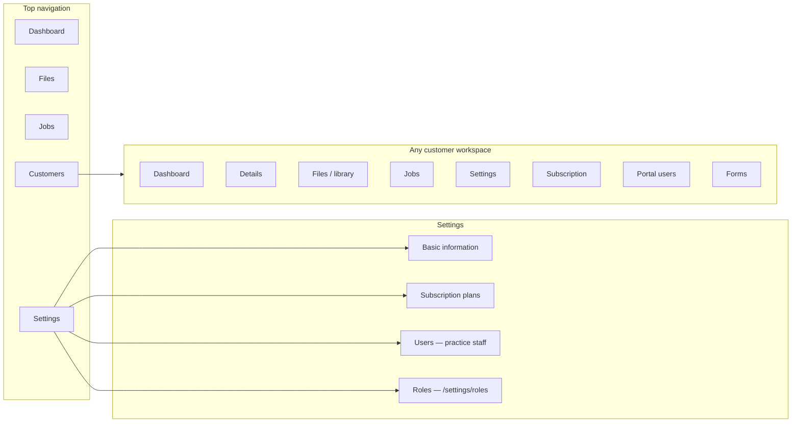

# Superadmin — role guide

This document describes **what a Superadmin is**, **what they can see and do** in the product, and **how that differs** from other practice staff. It is written for **end users and internal operators** (not developers).

---

## 1. What “Superadmin” means

A **Superadmin** is a **practice staff** login that has been given **full administrative authority** for your organisation in the app.

Technically, the account carries an **administrator flag** (not a normal “role” row like Manager or Accountant). In practice that means:

| Behaviour | What it implies for you |
|-----------|-------------------------|
| **Permission bypass** | Normal “does this user have permission X?” checks **do not block** a Superadmin. They are treated as having **every** permission the product can enforce on API routes. |
| **No customer assignment gate** | Other staff must often be **assigned to specific customers** before they can open that customer’s workspace. A Superadmin can work with **any customer** in the system without that limitation. |
| **Admin-only screens** | Some **Settings** areas (for example **Users** and **Roles**) are **restricted to Superadmin** in the UI. |

**Important:** Superadmin is powerful. Only trusted people should hold it, and you should use **Manager** or **Accountant** for day-to-day client work where possible.

---

## 2. Main navigation (top level)

A Superadmin using the **staff** application sees the full **practice** navigation, including:

| Area | What it is for (summary) |
|------|---------------------------|
| **Dashboard** | Practice-wide summary and widgets (aggregates, onboarding status, etc.). |
| **Files** | The **global files / drive** view (folders and documents across the practice, not tied to one customer tab). |
| **Jobs** | Practice-wide **file tasks / jobs** list and workflows. |
| **Customers** | The **customer directory** — every client organisation you manage. |
| **Settings** | Practice configuration: **basic information**, **subscription plans**, **practice users**, and **role definitions** (see §3). |

Superadmins are **not** “portal-only” users: they do not log in as a single client company. They operate **above** that layer and can open **any** customer from **Customers**.

---

## 3. Settings (Superadmin-specific depth)

Under **Settings**, a Superadmin can use everything that depends on admin access, including:

### 3.1 Basic information

- View and update **practice profile** and related staff settings where the product allows (same entry as other staff with settings permissions, but Superadmin is never blocked by missing keys).

### 3.2 Subscription (catalogue)

Here “subscription” means **subscription plans** for your product — the **catalogue** of plans (create, edit, assign building blocks, activate/deactivate as your UI allows).

- **Manage subscription plans** for the whole practice.  
- This is separate from **per-customer subscription** assignment inside a customer workspace (see §4.4).

### 3.3 Users (practice staff)

**Superadmin-only** in the UI for this section.

- **Add and manage practice users** — the people who work for **your firm** (not the client’s portal logins).  
- When creating a practice user, you typically choose:
  - **Superadmin** (full bypass, as in §1), **or**
  - A single **staff role** such as **Manager** or **Accountant** (day-to-day roles with a fixed permission bundle unless you customise roles).

So: **inside Settings → Users**, a Superadmin **adds Managers and Accountants** (and other Superadmins if your policy allows).

> **Client portal users** (Customer admin / Customer user) are **not** created on this screen. They are created **per customer** under that customer’s **Portal users** (see §4.5).

### 3.4 Roles (permission templates)

There is an admin-only route to edit **named roles** and their **permission matrix** (which keys each role carries). In the app this is **`/settings/roles`** (Superadmin only).  
Use this when your organisation needs to **tune** what Manager / Accountant / portal roles can do beyond the defaults.

---

## 4. Customers — what a Superadmin can do for every customer

From **Customers**, a Superadmin can open **any** customer record. For **each** customer, the **customer workspace** behaves as follows.

### 4.1 Tabs / sections (full workspace)

For **every customer**, a Superadmin can use **all** workspace areas, including:

| Section | Typical use |
|---------|-------------|
| **Dashboard** | Customer-level summary and status. |
| **Details** | Company profile, onboarding fields, status, notes — **edit** where the product allows. |
| **Files** (library / documents) | Customer’s **document library**: browse, upload, organise, assign work, same as full staff access. |
| **Jobs** | Customer-scoped **jobs / file tasks** — view and act on pipelines for that client. |
| **Settings** | **Customer-level settings** (profile, preferences, and anything exposed under that tab for the client record). |

Because Superadmin bypasses permission checks, they are **not** limited by missing `customer:read`, `job:read`, etc.

### 4.2 Subscription on the customer

Inside the customer workspace, where the product exposes **Subscription** (often from **Settings** or a dedicated subscription area):

- **View** the customer’s current plan / assignment.  
- **Assign or change** the subscription **for that customer** (subject to your catalogue and business rules in the UI).

This is **per-customer** subscription management, distinct from **Settings → Subscription** which is about **plan definitions** for the whole practice.

### 4.3 Users (portal users for that customer)

Under the customer’s **Users** (or **Portal users**) area:

- **Invite, edit, or disable** logins that belong to **that client organisation** (Customer admin, Customer user, etc.).  
- Superadmin can maintain portal access **without** being limited to “only customers I’m assigned to.”

### 4.4 Forms

- Open and review **forms** associated with the customer (onboarding / registration / data capture, depending on your deployment).  
- Use this for **compliance checks**, onboarding QA, and support.

### 4.5 Files and “Details” together

- **Details** holds structured **customer data** (and often actions such as export — see §5).  
- **Files / library** (and **Jobs**) hold **documents and processing**.  
- A Superadmin can **upload and manage files** for the customer from the **library / documents** flows and work **jobs** from the Jobs tab.  
- If your build surfaces **file-related actions** from the Details context (shortcuts, links, or embedded widgets), Superadmin can use those as well — there is no artificial cap below “full staff + full customer scope.”

---

## 5. Exporting data (practice-wide and per customer)

Superadmin can use the product’s **export** capabilities without permission errors.

### 5.1 Export one customer (wide detail export)

- From **customer Details** (or the export control your UI provides there), download a **wide export** of **that customer’s** data.  
- Formats are typically **CSV** or **spreadsheet (XLSX)**.  
- Content is aligned with the **full customer detail** payload (flattened keys in the export file), suitable for audits, migrations, or offline review.

### 5.2 Export many customers (filtered list export)

- From the **Customers** list (admin tooling), run a **filtered list export**: choose columns and filters (for example date range, name, onboarding status).  
- Output is again **CSV or XLSX**, with a **row cap** enforced by the product so very large exports must be narrowed by filters.

**Operational note:** Exports can contain **personal and commercial confidential** data. Restrict Superadmin accounts and follow your firm’s **data handling policy**.

---

## 6. Flow diagram (high level)

---

## 7. Quick reference checklist

| Capability | Superadmin |
|------------|------------|
| See **Dashboard**, **Files**, **Jobs**, **Customers**, **Settings** | Yes |
| Manage **subscription plans** (catalogue) | Yes |
| Manage **practice users** (add Manager / Accountant / Superadmin) | Yes (Users screen) |
| Edit **role templates** | Yes (`/settings/roles`) |
| Open **any** customer | Yes |
| Per customer: **Dashboard**, **Details**, **Files**, **Jobs**, **Settings** | Yes |
| Per customer: **subscription** view / assign | Yes (where UI exposes it) |
| Per customer: **portal users** | Yes |
| Per customer: **forms** | Yes |
| **Export** one customer | Yes |
| **Export** customer list (filtered) | Yes |

---

## 8. Related documents

- **`docs/roles-and-permissions-guide.md`** — All roles (Manager, Accountant, portal users) and how assignments work.  
- **`docs/permissions-reference.md`** — Meaning of individual permission **keys** (relevant when customising roles).

---

*This guide describes Superadmin capabilities as implemented in the product. Labels and exact menu names may vary slightly by release; if something is missing from your build, compare with your deployed version or release notes.*
